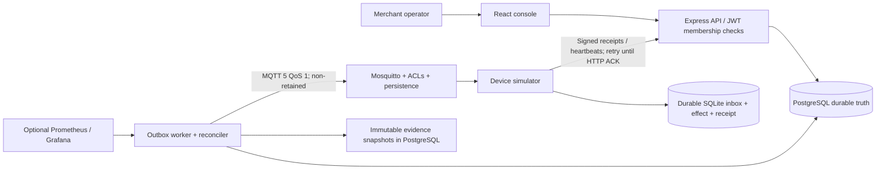

# Architecture and data model

## Relationships

Merchants have devices and memberships. Users gain access through `(user_id, merchant_id, role)`, queried on every merchant request. JWT contains a user identity, not trusted merchant authority. Payments use exact bigint minor units returned as strings. A composite device/merchant foreign key prevents mismatched ownership. Each payment has one unique logical command; each command has one unique outbox row. Outbox attempts each have a unique lease token. Receipts link to the originating command/device and credential version. Incidents deduplicate `(merchant,kind,resource)` and hold append-only evidence snapshots; audit records track operational actions.

## Acceptance

Normalize and validate input → hash canonical semantic content → transactionally insert payment under `(merchant,idempotency_key)` uniqueness → create command and outbox → commit → return. A concurrent duplicate waits for PostgreSQL uniqueness resolution, then reads the committed original. Conflicting content returns 409. Network failure after commit is ambiguous; retry the same key.

## Dispatch

Claim at most four rows concurrently using `FOR UPDATE SKIP LOCKED`, commit each short lease, then publish outside transactions. Every attempt gets a fencing token. Finishing requires the token to match and its lease to remain live. An old worker may still publish; it cannot overwrite the newer database claim. Command identity stays stable, making duplicate delivery safe for the synthetic simulator.

## State machine

```mermaid
stateDiagram-v2
  [*] --> pending: payment + command + outbox commit
  pending --> published: broker ACK recorded
  pending --> completed: verified receipt arrives first
  published --> completed: verified receipt
  pending --> unknown: exhausted uncertain delivery
  published --> unknown: exhausted uncertain delivery
  pending --> expired: command TTL
  published --> expired: command TTL
  unknown --> expired: signed expiry evidence
  unknown --> completed: verified in-time completion arrives late
  expired --> completed: delayed proof of in-time effect; conflict preserved
```

Completed is terminal. A contradictory expiry receipt is stored with `conflicting=true` without regressing completion. A purported effect after command expiry becomes unknown and is investigated. Dispatch status (`pending/leased/published/exhausted/permanent/expired`) is separate from command state. Published means broker acknowledgment, never physical audio.

## Reconciliation

One bounded pass under a transaction advisory lock processes up to 100 conditions, captures incident evidence, expires commands and schedules missing-receipt redelivery. It uses stable command IDs and preserves terminal completions. Old heartbeat replay tombstones are removed in batches of 500 after one day; receipt replay tombstones are retained. Attempts, payments and evidence require an explicit archival policy as the dataset grows.

The API's readiness requires database connectivity and a worker progress record newer than 30 seconds. Liveness confirms the HTTP process responds. Worker health depends on completed-loop progress, so a stuck loop becomes unhealthy even when the process remains alive. Broker failure is reported separately; the API can still accept durable work while it is unavailable.
